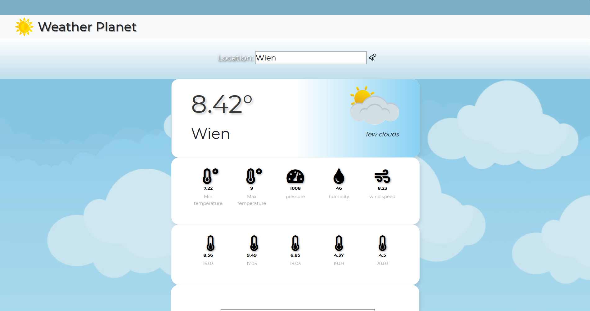
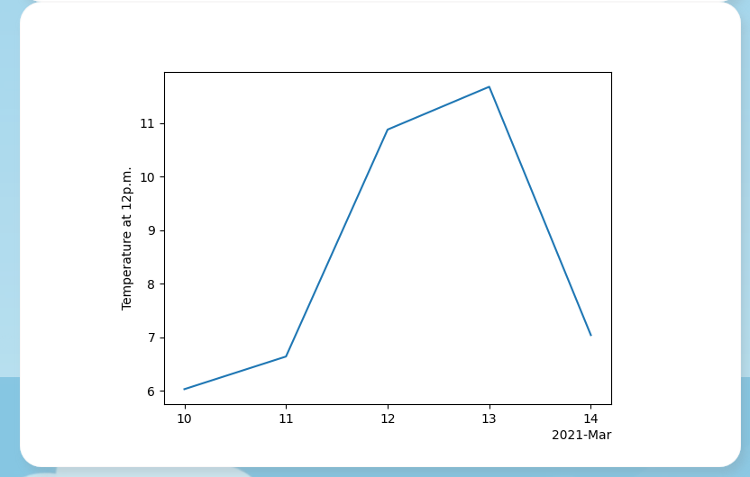
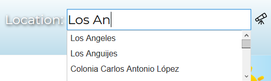

# Project Name
Weather App

## Table of contents
* [General info](#general-info)
* [Screenshots](#screenshots)
* [Technologies](#technologies)
* [Setup](#setup)
* [Features](#features)
* [Status](#status)

## General info
Weather App is a simple metheorology app made in Python/Flask and HTML5/CSS/Bootstrap.  
The data is downloaded from OpenWeatherMap API.

## Screenshots

## Technologies
Python
Flask
HTML5/CSS/Bootstrap
OpenWeatherMap API

## Setup
App is run with app.py. Then the user should open the run address in the web browser (default 127.0.0.1:5000)

## Features
  
Location input is a box with scripted autocomplete scroll-down list. After pressing the telescope icon the app makes a call to OpenWeatherMap and receives the weather data.
The data is showcased on a widget, together with a graph of historical temperature at 12p.m. by day. Everytime a call is made, data for 5 previous days is added to data/temp_data.json. 

To-do:
Expand data analysis capabilities

## Status
Finished